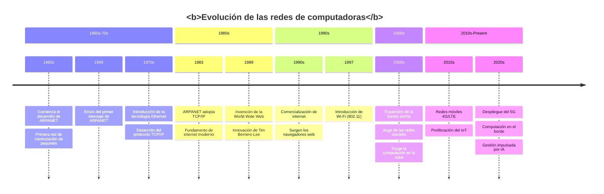

```mermaid
timeline
    title <b>Evolución de las redes de computadoras</b>
    
    section 1960s-70s
        1960s : Comienza el desarrollo de ARPANET
              : Primera red de conmutación de paquetes
        1969  : Envío del primer mensaje de ARPANET
        1970s : Introducción de la tecnología Ethernet
              : Desarrollo del protocolo TCP/IP
    
    section 1980s
        1983  : ARPANET adopta TCP/IP
              : Fundamento de internet moderno
        1989  : Invención de la World Wide Web
              : Innovación de Tim Berners-Lee
    
    section 1990s
        1990s : Comercialización de internet
              : Surgen los navegadores web
        1997  : Introducción de Wi-Fi (802.11)
    
    section 2000s
        2000s : Expansión de la banda ancha
              : Auge de las redes sociales
              : Surge la computación en la nube
    
    section 2010s-Present
        2010s : Redes móviles 4G/LTE
              : Proliferación del IoT
        2020s : Despliegue del 5G
              : Computación en el borde
              : Gestión impulsada por IA
```
