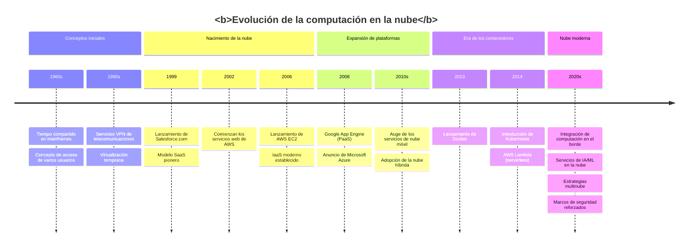

```mermaid
timeline
    title <b>Evolución de la computación en la nube</b>
    
    section Conceptos iniciales
        1960s : Tiempo compartido en mainframes
              : Concepto de acceso de varios usuarios
        1990s : Servicios VPN de telecomunicaciones
              : Virtualización temprana
    
    section Nacimiento de la nube
        1999  : Lanzamiento de Salesforce.com
              : Modelo SaaS pionero
        2002  : Comienzan los servicios web de AWS
        2006  : Lanzamiento de AWS EC2
              : IaaS moderno establecido
    
    section Expansión de plataformas
        2008  : Google App Engine (PaaS)
              : Anuncio de Microsoft Azure
        2010s : Auge de los servicios de nube móvil
              : Adopción de la nube híbrida
    
    section Era de los contenedores
        2013  : Lanzamiento de Docker
        2014  : Introducción de Kubernetes
              : AWS Lambda (serverless)
    
    section Nube moderna
        2020s : Integración de computación en el borde
              : Servicios de IA/ML en la nube
              : Estrategias multinube
              : Marcos de seguridad reforzados
```
