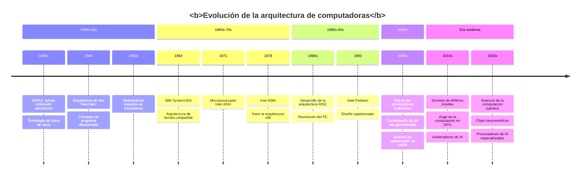

```mermaid
timeline
    title <b>Evolución de la arquitectura de computadoras</b>
    
    section 1940s-50s
        1940s : ENIAC, primer ordenador electrónico
              : Tecnología de tubos de vacío
        1945  : Arquitectura de Von Neumann
              : Concepto de programa almacenado
        1950s : Ordenadores basados en transistores
    
    section 1960s-70s
        1964  : IBM System/360
              : Arquitectura de familia compatible
        1971  : Microprocesador Intel 4004
        1978  : Intel 8086
              : Nace la arquitectura x86
    
    section 1980s-90s
        1980s : Desarrollo de la arquitectura RISC
              : Revolución del PC
        1993  : Intel Pentium
              : Diseño superescalar
    
    section 2000s
        2000s : Era de los procesadores multinúcleo
              : Computación de 64 bits generalizada
              : Avances en optimización de caché
    
    section Era moderna
        2010s : Dominio de ARM en móviles
              : Auge de la computación en GPU
              : Aceleradores de IA
        2020s : Avances de la computación cuántica
              : Chips neuromórficos
              : Procesadores de IA especializados
```
