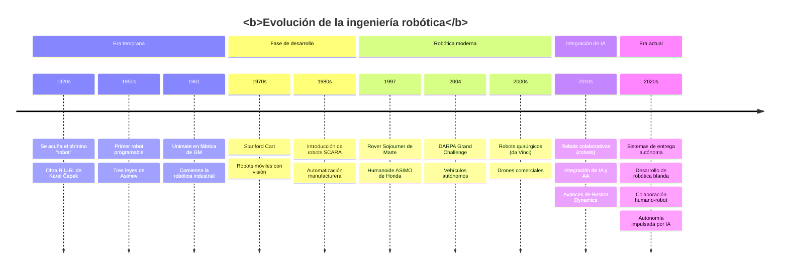

```mermaid
timeline
    title <b>Evolución de la ingeniería robótica</b>
    
    section Era temprana
        1920s : Se acuña el término "robot"
              : Obra R.U.R. de Karel Čapek
        1950s : Primer robot programable
              : Tres leyes de Asimov
        1961  : Unimate en fábrica de GM
              : Comienza la robótica industrial
    
    section Fase de desarrollo
        1970s : Stanford Cart
              : Robots móviles con visión
        1980s : Introducción de robots SCARA
              : Automatización manufacturera
    
    section Robótica moderna
        1997  : Rover Sojourner de Marte
              : Humanoide ASIMO de Honda
        2004  : DARPA Grand Challenge
              : Vehículos autónomos
        2000s : Robots quirúrgicos (da Vinci)
              : Drones comerciales
    
    section Integración de IA
        2010s : Robots colaborativos (cobots)
              : Integración de IA y AA
              : Avances de Boston Dynamics
    
    section Era actual
        2020s : Sistemas de entrega autónoma
              : Desarrollo de robótica blanda
              : Colaboración humano-robot
              : Autonomía impulsada por IA
```
