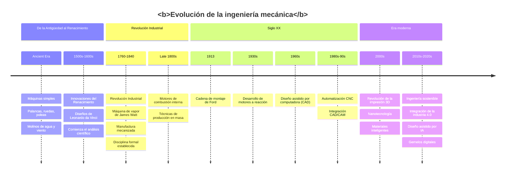

```mermaid
timeline
    title <b>Evolución de la ingeniería mecánica</b>
    
    section De la Antigüedad al Renacimiento
        Ancient Era : Máquinas simples
                    : Palancas, ruedas, poleas
                    : Molinos de agua y viento
        1500s-1600s : Innovaciones del Renacimiento
                    : Diseños de Leonardo da Vinci
                    : Comienza el análisis científico
    
    section Revolución Industrial
        1760-1840 : Revolución Industrial
                  : Máquina de vapor de James Watt
                  : Manufactura mecanizada
                  : Disciplina formal establecida
        Late 1800s : Motores de combustión interna
                   : Técnicas de producción en masa
    
    section Siglo XX
        1913  : Cadena de montaje de Ford
        1930s : Desarrollo de motores a reacción
        1960s : Diseño asistido por computadora (CAD)
        1980s-90s : Automatización CNC
                  : Integración CAD/CAM
    
    section Era moderna
        2000s : Revolución de la impresión 3D
              : Nanotecnología
              : Materiales inteligentes
        2010s-2020s : Ingeniería sostenible
                    : Integración de la Industria 4.0
                    : Diseño asistido por IA
                    : Gemelos digitales
```
