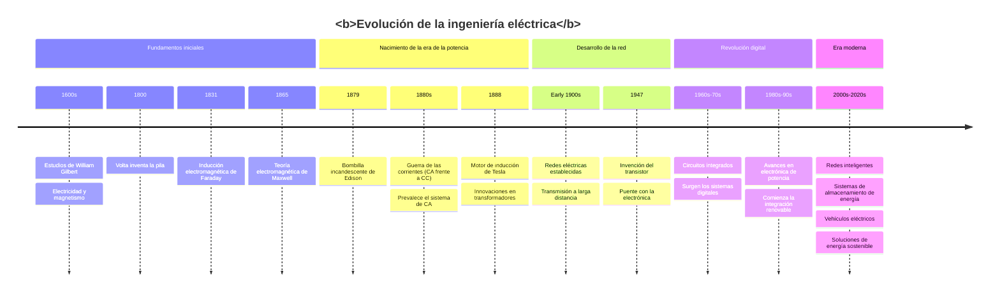

```mermaid
timeline
    title <b>Evolución de la ingeniería eléctrica</b>
    
    section Fundamentos iniciales
        1600s : Estudios de William Gilbert
              : Electricidad y magnetismo
        1800  : Volta inventa la pila
        1831  : Inducción electromagnética de Faraday
        1865  : Teoría electromagnética de Maxwell
    
    section Nacimiento de la era de la potencia
        1879  : Bombilla incandescente de Edison
        1880s : Guerra de las corrientes (CA frente a CC)
              : Prevalece el sistema de CA
        1888  : Motor de inducción de Tesla
              : Innovaciones en transformadores
    
    section Desarrollo de la red
        Early 1900s : Redes eléctricas establecidas
                    : Transmisión a larga distancia
        1947  : Invención del transistor
              : Puente con la electrónica
    
    section Revolución digital
        1960s-70s : Circuitos integrados
                  : Surgen los sistemas digitales
        1980s-90s : Avances en electrónica de potencia
                  : Comienza la integración renovable
    
    section Era moderna
        2000s-2020s : Redes inteligentes
                    : Sistemas de almacenamiento de energía
                    : Vehículos eléctricos
                    : Soluciones de energía sostenible
```
