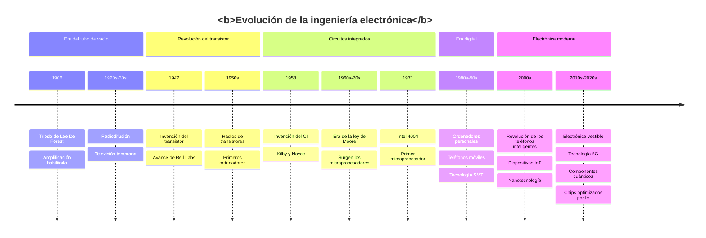

```mermaid
timeline
    title <b>Evolución de la ingeniería electrónica</b>
    
    section Era del tubo de vacío
        1906  : Triodo de Lee De Forest
              : Amplificación habilitada
        1920s-30s : Radiodifusión
                  : Televisión temprana
    
    section Revolución del transistor
        1947  : Invención del transistor
              : Avance de Bell Labs
        1950s : Radios de transistores
              : Primeros ordenadores
    
    section Circuitos integrados
        1958  : Invención del CI
              : Kilby y Noyce
        1960s-70s : Era de la ley de Moore
                  : Surgen los microprocesadores
        1971  : Intel 4004
              : Primer microprocesador
    
    section Era digital
        1980s-90s : Ordenadores personales
                  : Teléfonos móviles
                  : Tecnología SMT
    
    section Electrónica moderna
        2000s : Revolución de los teléfonos inteligentes
              : Dispositivos IoT
              : Nanotecnología
        2010s-2020s : Electrónica vestible
                    : Tecnología 5G
                    : Componentes cuánticos
                    : Chips optimizados por IA
```
