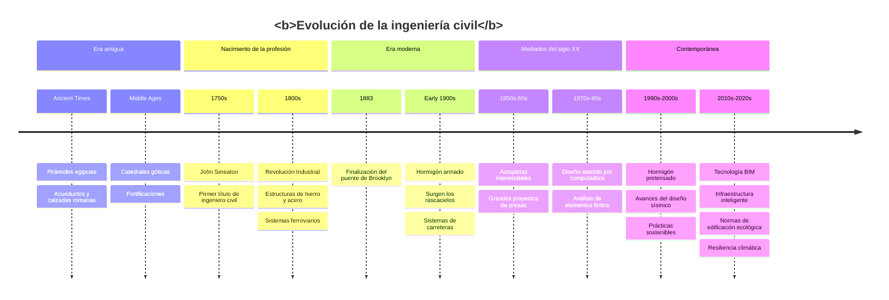

```mermaid
timeline
    title <b>Evolución de la ingeniería civil</b>
    
    section Era antigua
        Ancient Times : Pirámides egipcias
                      : Acueductos y calzadas romanas
        Middle Ages : Catedrales góticas
                    : Fortificaciones
    
    section Nacimiento de la profesión
        1750s : John Smeaton
              : Primer título de ingeniero civil
        1800s : Revolución Industrial
              : Estructuras de hierro y acero
              : Sistemas ferroviarios
    
    section Era moderna
        1883  : Finalización del puente de Brooklyn
        Early 1900s : Hormigón armado
                    : Surgen los rascacielos
                    : Sistemas de carreteras
    
    section Mediados del siglo XX
        1950s-60s : Autopistas interestatales
                  : Grandes proyectos de presas
        1970s-80s : Diseño asistido por computadora
                  : Análisis de elementos finitos
    
    section Contemporánea
        1990s-2000s : Hormigón pretensado
                    : Avances del diseño sísmico
                    : Prácticas sostenibles
        2010s-2020s : Tecnología BIM
                    : Infraestructura inteligente
                    : Normas de edificación ecológica
                    : Resiliencia climática
```
