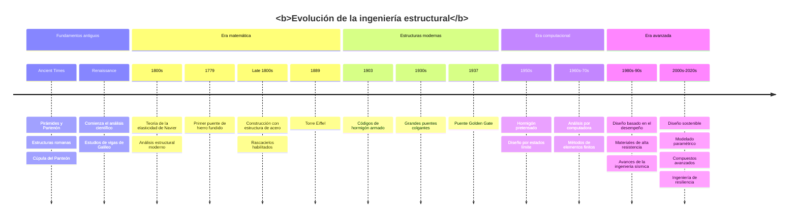

```mermaid
timeline
    title <b>Evolución de la ingeniería estructural</b>
    
    section Fundamentos antiguos
        Ancient Times : Pirámides y Partenón
                      : Estructuras romanas
                      : Cúpula del Panteón
        Renaissance : Comienza el análisis científico
                    : Estudios de vigas de Galileo
    
    section Era matemática
        1800s : Teoría de la elasticidad de Navier
              : Análisis estructural moderno
        1779  : Primer puente de hierro fundido
        Late 1800s : Construcción con estructura de acero
                   : Rascacielos habilitados
        1889  : Torre Eiffel
    
    section Estructuras modernas
        1903  : Códigos de hormigón armado
        1930s : Grandes puentes colgantes
        1937  : Puente Golden Gate
    
    section Era computacional
        1950s : Hormigón pretensado
              : Diseño por estados límite
        1960s-70s : Análisis por computadora
                  : Métodos de elementos finitos
    
    section Era avanzada
        1980s-90s : Diseño basado en el desempeño
                  : Materiales de alta resistencia
                  : Avances de la ingeniería sísmica
        2000s-2020s : Diseño sostenible
                    : Modelado paramétrico
                    : Compuestos avanzados
                    : Ingeniería de resiliencia
```
