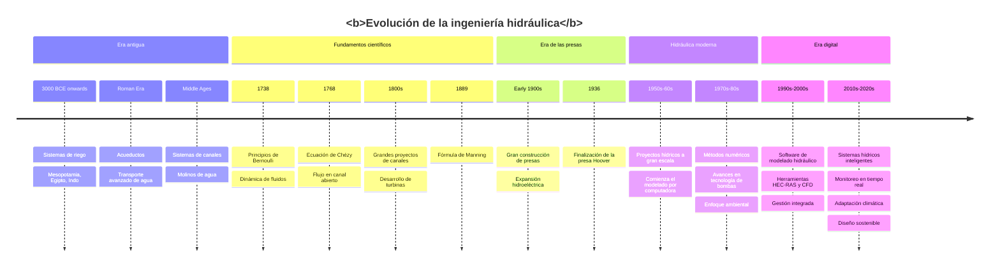

```mermaid
timeline
    title <b>Evolución de la ingeniería hidráulica</b>
    
    section Era antigua
        3000 BCE onwards : Sistemas de riego
                         : Mesopotamia, Egipto, Indo
        Roman Era : Acueductos
                  : Transporte avanzado de agua
        Middle Ages : Sistemas de canales
                    : Molinos de agua
    
    section Fundamentos científicos
        1738  : Principios de Bernoulli
              : Dinámica de fluidos
        1768  : Ecuación de Chézy
              : Flujo en canal abierto
        1800s : Grandes proyectos de canales
              : Desarrollo de turbinas
        1889  : Fórmula de Manning
    
    section Era de las presas
        Early 1900s : Gran construcción de presas
                    : Expansión hidroeléctrica
        1936  : Finalización de la presa Hoover
    
    section Hidráulica moderna
        1950s-60s : Proyectos hídricos a gran escala
                  : Comienza el modelado por computadora
        1970s-80s : Métodos numéricos
                  : Avances en tecnología de bombas
                  : Enfoque ambiental
    
    section Era digital
        1990s-2000s : Software de modelado hidráulico
                    : Herramientas HEC-RAS y CFD
                    : Gestión integrada
        2010s-2020s : Sistemas hídricos inteligentes
                    : Monitoreo en tiempo real
                    : Adaptación climática
                    : Diseño sostenible
```
