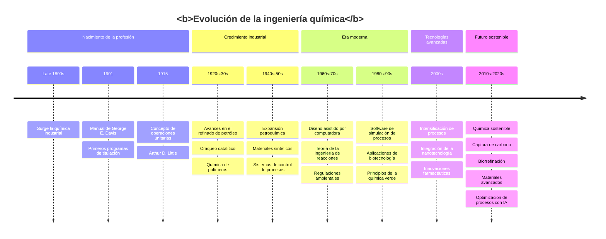

```mermaid
timeline
    title <b>Evolución de la ingeniería química</b>
    
    section Nacimiento de la profesión
        Late 1800s : Surge la química industrial
        1901  : Manual de George E. Davis
              : Primeros programas de titulación
        1915  : Concepto de operaciones unitarias
              : Arthur D. Little
    
    section Crecimiento industrial
        1920s-30s : Avances en el refinado de petróleo
                  : Craqueo catalítico
                  : Química de polímeros
        1940s-50s : Expansión petroquímica
                  : Materiales sintéticos
                  : Sistemas de control de procesos
    
    section Era moderna
        1960s-70s : Diseño asistido por computadora
                  : Teoría de la ingeniería de reacciones
                  : Regulaciones ambientales
        1980s-90s : Software de simulación de procesos
                  : Aplicaciones de biotecnología
                  : Principios de la química verde
    
    section Tecnologías avanzadas
        2000s : Intensificación de procesos
              : Integración de la nanotecnología
              : Innovaciones farmacéuticas
    
    section Futuro sostenible
        2010s-2020s : Química sostenible
                    : Captura de carbono
                    : Biorrefinación
                    : Materiales avanzados
                    : Optimización de procesos con IA
```
