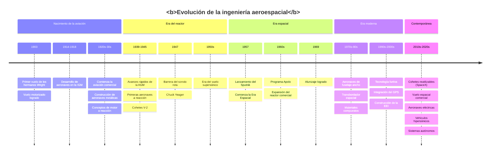

```mermaid
timeline
    title <b>Evolución de la ingeniería aeroespacial</b>
    
    section Nacimiento de la aviación
        1903  : Primer vuelo de los hermanos Wright
              : Vuelo motorizado logrado
        1914-1918 : Desarrollo de aeronaves en la IGM
        1920s-30s : Comienza la aviación comercial
                  : Construcción de aeronaves metálicas
                  : Conceptos de motor a reacción
    
    section Era del reactor
        1939-1945 : Avances rápidos de la IIGM
                  : Primeras aeronaves a reacción
                  : Cohetes V-2
        1947  : Barrera del sonido rota
              : Chuck Yeager
        1950s : Era del vuelo supersónico
    
    section Era espacial
        1957  : Lanzamiento del Sputnik
              : Comienza la Era Espacial
        1960s : Programa Apolo
              : Expansión del reactor comercial
        1969  : Alunizaje logrado
    
    section Era moderna
        1970s-80s : Aeronaves de fuselaje ancho
                  : Transbordador espacial
                  : Materiales compuestos
        1990s-2000s : Tecnología furtiva
                    : Integración del GPS
                    : Construcción de la EEI
    
    section Contemporánea
        2010s-2020s : Cohetes reutilizables (SpaceX)
                    : Vuelo espacial comercial
                    : Aeronaves eléctricas
                    : Vehículos hipersónicos
                    : Sistemas autónomos
```
