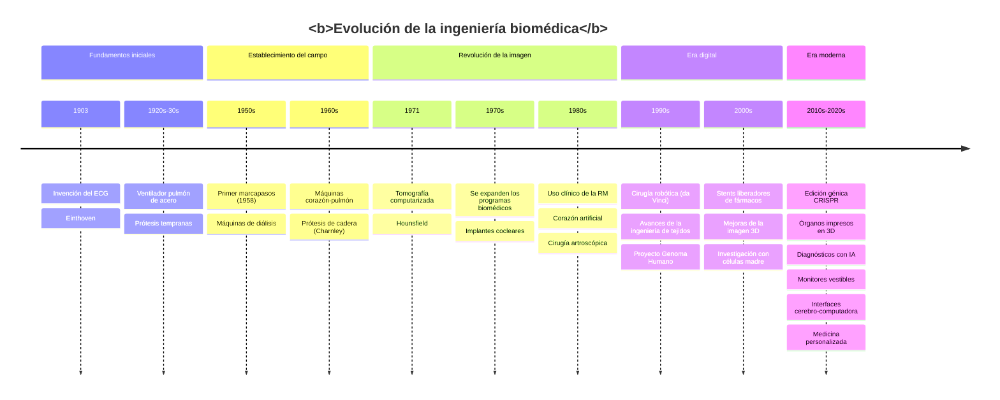

```mermaid
timeline
    title <b>Evolución de la ingeniería biomédica</b>
    
    section Fundamentos iniciales
        1903  : Invención del ECG
              : Einthoven
        1920s-30s : Ventilador pulmón de acero
                  : Prótesis tempranas
    
    section Establecimiento del campo
        1950s : Primer marcapasos (1958)
              : Máquinas de diálisis
        1960s : Máquinas corazón-pulmón
              : Prótesis de cadera (Charnley)
    
    section Revolución de la imagen
        1971  : Tomografía computarizada
              : Hounsfield
        1970s : Se expanden los programas biomédicos
              : Implantes cocleares
        1980s : Uso clínico de la RM
              : Corazón artificial
              : Cirugía artroscópica
    
    section Era digital
        1990s : Cirugía robótica (da Vinci)
              : Avances de la ingeniería de tejidos
              : Proyecto Genoma Humano
        2000s : Stents liberadores de fármacos
              : Mejoras de la imagen 3D
              : Investigación con células madre
    
    section Era moderna
        2010s-2020s : Edición génica CRISPR
                    : Órganos impresos en 3D
                    : Diagnósticos con IA
                    : Monitores vestibles
                    : Interfaces cerebro-computadora
                    : Medicina personalizada
```
