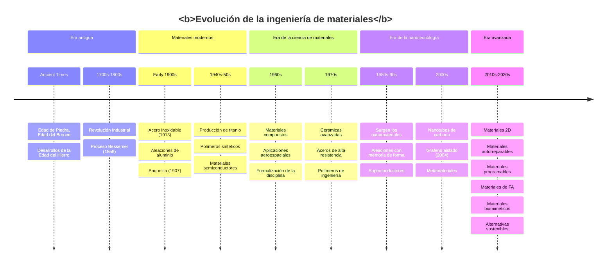

```mermaid
timeline
    title <b>Evolución de la ingeniería de materiales</b>
    
    section Era antigua
        Ancient Times : Edad de Piedra, Edad del Bronce
                      : Desarrollos de la Edad del Hierro
        1700s-1800s : Revolución Industrial
                    : Proceso Bessemer (1856)
    
    section Materiales modernos
        Early 1900s : Acero inoxidable (1913)
                    : Aleaciones de aluminio
                    : Baquelita (1907)
        1940s-50s : Producción de titanio
                  : Polímeros sintéticos
                  : Materiales semiconductores
    
    section Era de la ciencia de materiales
        1960s : Materiales compuestos
              : Aplicaciones aeroespaciales
              : Formalización de la disciplina
        1970s : Cerámicas avanzadas
              : Aceros de alta resistencia
              : Polímeros de ingeniería
    
    section Era de la nanotecnología
        1980s-90s : Surgen los nanomateriales
                  : Aleaciones con memoria de forma
                  : Superconductores
        2000s : Nanotubos de carbono
              : Grafeno aislado (2004)
              : Metamateriales
    
    section Era avanzada
        2010s-2020s : Materiales 2D
                    : Materiales autorreparables
                    : Materiales programables
                    : Materiales de FA
                    : Materiales biomiméticos
                    : Alternativas sostenibles
```
