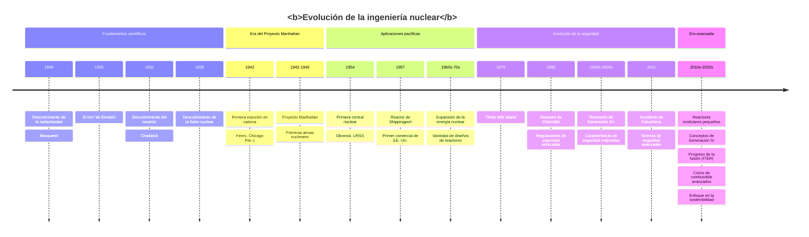

```mermaid
timeline
    title <b>Evolución de la ingeniería nuclear</b>
    
    section Fundamentos científicos
        1896  : Descubrimiento de la radiactividad
              : Becquerel
        1905  : E=mc² de Einstein
        1932  : Descubrimiento del neutrón
              : Chadwick
        1938  : Descubrimiento de la fisión nuclear
    
    section Era del Proyecto Manhattan
        1942  : Primera reacción en cadena
              : Fermi, Chicago Pile-1
        1942-1945 : Proyecto Manhattan
                  : Primeras armas nucleares
    
    section Aplicaciones pacíficas
        1954  : Primera central nuclear
              : Obninsk, URSS
        1957  : Reactor de Shippingport
              : Primer comercial de EE. UU.
        1960s-70s : Expansión de la energía nuclear
                  : Variedad de diseños de reactores
    
    section Evolución de la seguridad
        1979  : Three Mile Island
        1986  : Desastre de Chernóbil
              : Regulaciones de seguridad reforzadas
        1990s-2000s : Reactores de Generación III+
                    : Características de seguridad mejoradas
        2011  : Accidente de Fukushima
              : Normas de seguridad avanzadas
    
    section Era avanzada
        2010s-2020s : Reactores modulares pequeños
                    : Conceptos de Generación IV
                    : Progreso de la fusión (ITER)
                    : Ciclos de combustible avanzados
                    : Enfoque en la sostenibilidad
```
