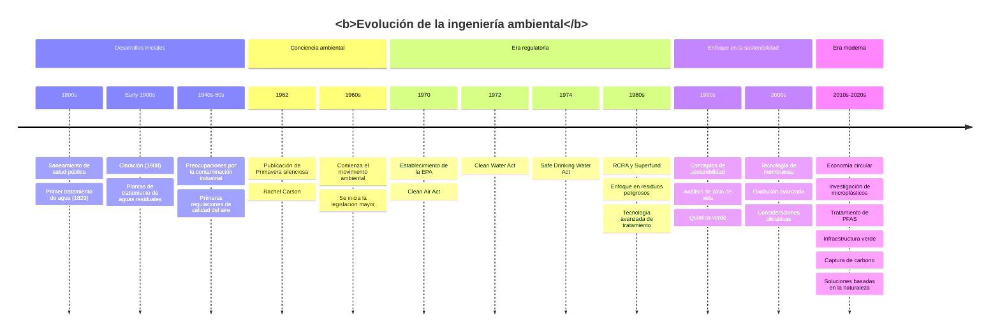

```mermaid
timeline
    title <b>Evolución de la ingeniería ambiental</b>
    
    section Desarrollos iniciales
        1800s : Saneamiento de salud pública
              : Primer tratamiento de agua (1829)
        Early 1900s : Cloración (1908)
                    : Plantas de tratamiento de aguas residuales
        1940s-50s : Preocupaciones por la contaminación industrial
                  : Primeras regulaciones de calidad del aire
    
    section Conciencia ambiental
        1962  : Publicación de Primavera silenciosa
              : Rachel Carson
        1960s : Comienza el movimiento ambiental
              : Se inicia la legislación mayor
    
    section Era regulatoria
        1970  : Establecimiento de la EPA
              : Clean Air Act
        1972  : Clean Water Act
        1974  : Safe Drinking Water Act
        1980s : RCRA y Superfund
              : Enfoque en residuos peligrosos
              : Tecnología avanzada de tratamiento
    
    section Enfoque en la sostenibilidad
        1990s : Conceptos de sostenibilidad
              : Análisis de ciclo de vida
              : Química verde
        2000s : Tecnología de membranas
              : Oxidación avanzada
              : Consideraciones climáticas
    
    section Era moderna
        2010s-2020s : Economía circular
                    : Investigación de microplásticos
                    : Tratamiento de PFAS
                    : Infraestructura verde
                    : Captura de carbono
                    : Soluciones basadas en la naturaleza
```
