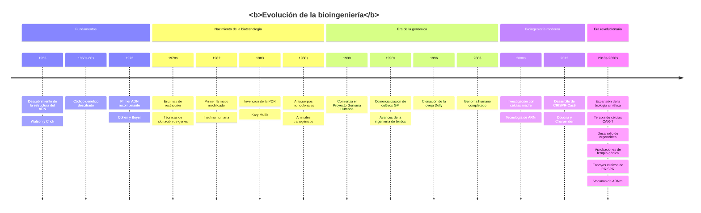

```mermaid
timeline
    title <b>Evolución de la bioingeniería</b>
    
    section Fundamentos
        1953  : Descubrimiento de la estructura del ADN
              : Watson y Crick
        1950s-60s : Código genético descifrado
        1973  : Primer ADN recombinante
              : Cohen y Boyer
    
    section Nacimiento de la biotecnología
        1970s : Enzimas de restricción
              : Técnicas de clonación de genes
        1982  : Primer fármaco modificado
              : Insulina humana
        1983  : Invención de la PCR
              : Kary Mullis
        1980s : Anticuerpos monoclonales
              : Animales transgénicos
    
    section Era de la genómica
        1990  : Comienza el Proyecto Genoma Humano
        1990s : Comercialización de cultivos GM
              : Avances de la ingeniería de tejidos
        1996  : Clonación de la oveja Dolly
        2003  : Genoma humano completado
    
    section Bioingeniería moderna
        2000s : Investigación con células madre
              : Tecnología de ARNi
        2012  : Desarrollo de CRISPR-Cas9
              : Doudna y Charpentier
    
    section Era revolucionaria
        2010s-2020s : Expansión de la biología sintética
                    : Terapia de células CAR-T
                    : Desarrollo de organoides
                    : Aprobaciones de terapia génica
                    : Ensayos clínicos de CRISPR
                    : Vacunas de ARNm
```
