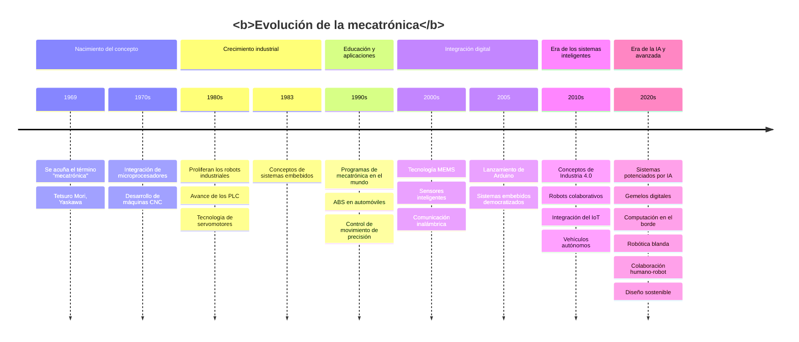

```mermaid
timeline
    title <b>Evolución de la mecatrónica</b>
    
    section Nacimiento del concepto
        1969  : Se acuña el término "mecatrónica"
              : Tetsuro Mori, Yaskawa
        1970s : Integración de microprocesadores
              : Desarrollo de máquinas CNC
    
    section Crecimiento industrial
        1980s : Proliferan los robots industriales
              : Avance de los PLC
              : Tecnología de servomotores
        1983  : Conceptos de sistemas embebidos
    
    section Educación y aplicaciones
        1990s : Programas de mecatrónica en el mundo
              : ABS en automóviles
              : Control de movimiento de precisión
    
    section Integración digital
        2000s : Tecnología MEMS
              : Sensores inteligentes
              : Comunicación inalámbrica
        2005  : Lanzamiento de Arduino
              : Sistemas embebidos democratizados
    
    section Era de los sistemas inteligentes
        2010s : Conceptos de Industria 4.0
              : Robots colaborativos
              : Integración del IoT
              : Vehículos autónomos
    
    section Era de la IA y avanzada
        2020s : Sistemas potenciados por IA
              : Gemelos digitales
              : Computación en el borde
              : Robótica blanda
              : Colaboración humano-robot
              : Diseño sostenible
```
