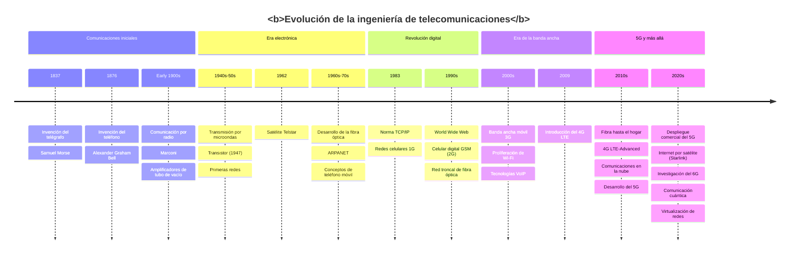

```mermaid
timeline
    title <b>Evolución de la ingeniería de telecomunicaciones</b>
    
    section Comunicaciones iniciales
        1837  : Invención del telégrafo
              : Samuel Morse
        1876  : Invención del teléfono
              : Alexander Graham Bell
        Early 1900s : Comunicación por radio
                    : Marconi
                    : Amplificadores de tubo de vacío
    
    section Era electrónica
        1940s-50s : Transmisión por microondas
                  : Transistor (1947)
                  : Primeras redes
        1962  : Satélite Telstar
        1960s-70s : Desarrollo de la fibra óptica
                  : ARPANET
                  : Conceptos de teléfono móvil
    
    section Revolución digital
        1983  : Norma TCP/IP
              : Redes celulares 1G
        1990s : World Wide Web
              : Celular digital GSM (2G)
              : Red troncal de fibra óptica
    
    section Era de la banda ancha
        2000s : Banda ancha móvil 3G
              : Proliferación de Wi-Fi
              : Tecnologías VoIP
        2009  : Introducción del 4G LTE
    
    section 5G y más allá
        2010s : Fibra hasta el hogar
              : 4G LTE-Advanced
              : Comunicaciones en la nube
              : Desarrollo del 5G
        2020s : Despliegue comercial del 5G
              : Internet por satélite (Starlink)
              : Investigación del 6G
              : Comunicación cuántica
              : Virtualización de redes
```
