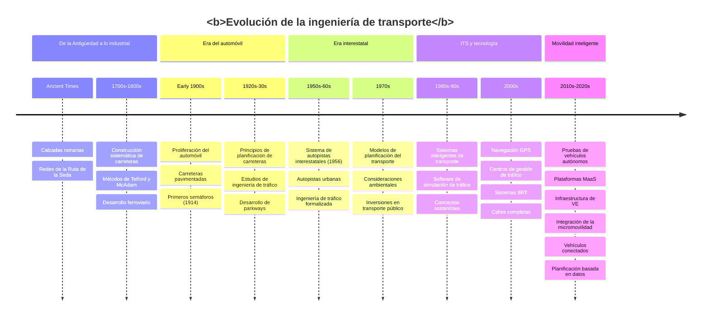

```mermaid
timeline
    title <b>Evolución de la ingeniería de transporte</b>
    
    section De la Antigüedad a lo industrial
        Ancient Times : Calzadas romanas
                      : Redes de la Ruta de la Seda
        1700s-1800s : Construcción sistemática de carreteras
                    : Métodos de Telford y McAdam
                    : Desarrollo ferroviario
    
    section Era del automóvil
        Early 1900s : Proliferación del automóvil
                    : Carreteras pavimentadas
                    : Primeros semáforos (1914)
        1920s-30s : Principios de planificación de carreteras
                  : Estudios de ingeniería de tráfico
                  : Desarrollo de parkways
    
    section Era interestatal
        1950s-60s : Sistema de autopistas interestatales (1956)
                  : Autopistas urbanas
                  : Ingeniería de tráfico formalizada
        1970s : Modelos de planificación del transporte
              : Consideraciones ambientales
              : Inversiones en transporte público
    
    section ITS y tecnología
        1980s-90s : Sistemas inteligentes de transporte
                  : Software de simulación de tráfico
                  : Conceptos sostenibles
        2000s : Navegación GPS
              : Centros de gestión de tráfico
              : Sistemas BRT
              : Calles completas
    
    section Movilidad inteligente
        2010s-2020s : Pruebas de vehículos autónomos
                    : Plataformas MaaS
                    : Infraestructura de VE
                    : Integración de la micromovilidad
                    : Vehículos conectados
                    : Planificación basada en datos
```
