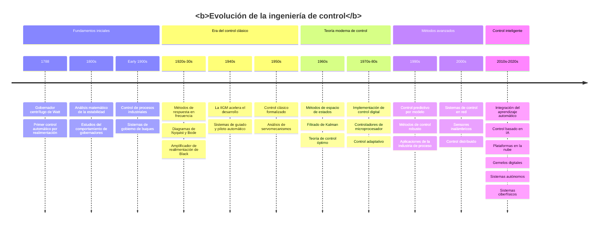

```mermaid
timeline
    title <b>Evolución de la ingeniería de control</b>
    
    section Fundamentos iniciales
        1788  : Gobernador centrífugo de Watt
              : Primer control automático por realimentación
        1800s : Análisis matemático de la estabilidad
              : Estudios del comportamiento de gobernadores
        Early 1900s : Control de procesos industriales
                    : Sistemas de gobierno de buques
    
    section Era del control clásico
        1920s-30s : Métodos de respuesta en frecuencia
                  : Diagramas de Nyquist y Bode
                  : Amplificador de realimentación de Black
        1940s : La IIGM acelera el desarrollo
              : Sistemas de guiado y piloto automático
        1950s : Control clásico formalizado
              : Análisis de servomecanismos
    
    section Teoría moderna de control
        1960s : Métodos de espacio de estados
              : Filtrado de Kalman
              : Teoría de control óptimo
        1970s-80s : Implementación de control digital
                  : Controladores de microprocesador
                  : Control adaptativo
    
    section Métodos avanzados
        1990s : Control predictivo por modelo
              : Métodos de control robusto
              : Aplicaciones de la industria de proceso
        2000s : Sistemas de control en red
              : Sensores inalámbricos
              : Control distribuido
    
    section Control inteligente
        2010s-2020s : Integración del aprendizaje automático
                    : Control basado en IA
                    : Plataformas en la nube
                    : Gemelos digitales
                    : Sistemas autónomos
                    : Sistemas ciberfísicos
```
