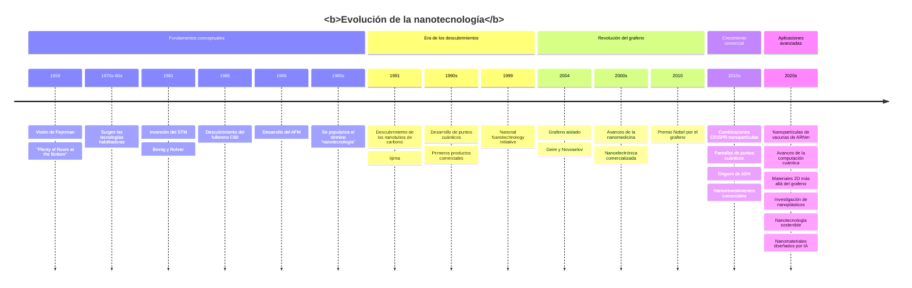

```mermaid
timeline
    title <b>Evolución de la nanotecnología</b>
    
    section Fundamentos conceptuales
        1959  : Visión de Feynman
              : "Plenty of Room at the Bottom"
        1970s-80s : Surgen las tecnologías habilitadoras
        1981  : Invención del STM
              : Binnig y Rohrer
        1985  : Descubrimiento del fullereno C60
        1986  : Desarrollo del AFM
        1980s : Se populariza el término "nanotecnología"
    
    section Era de los descubrimientos
        1991  : Descubrimiento de los nanotubos de carbono
              : Iijima
        1990s : Desarrollo de puntos cuánticos
              : Primeros productos comerciales
        1999  : National Nanotechnology Initiative
    
    section Revolución del grafeno
        2004  : Grafeno aislado
              : Geim y Novoselov
        2000s : Avances de la nanomedicina
              : Nanoelectrónica comercializada
        2010  : Premio Nobel por el grafeno
    
    section Crecimiento comercial
        2010s : Combinaciones CRISPR-nanopartículas
              : Pantallas de puntos cuánticos
              : Origami de ADN
              : Nanorrevestimientos comerciales
    
    section Aplicaciones avanzadas
        2020s : Nanopartículas de vacunas de ARNm
              : Avances de la computación cuántica
              : Materiales 2D más allá del grafeno
              : Investigación de nanoplásticos
              : Nanotecnología sostenible
              : Nanomateriales diseñados por IA
```
