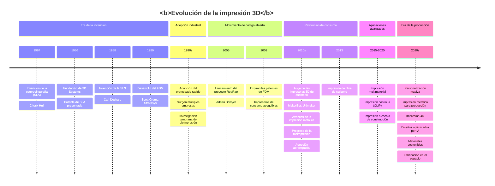

```mermaid
timeline
    title <b>Evolución de la impresión 3D</b>
    
    section Era de la invención
        1984  : Invención de la estereolitografía (SLA)
              : Chuck Hull
        1986  : Fundación de 3D Systems
              : Patente de SLA presentada
        1988  : Invención de la SLS
              : Carl Deckard
        1989  : Desarrollo del FDM
              : Scott Crump, Stratasys
    
    section Adopción industrial
        1990s : Adopción del prototipado rápido
              : Surgen múltiples empresas
              : Investigación temprana de bioimpresión
    
    section Movimiento de código abierto
        2005  : Lanzamiento del proyecto RepRap
              : Adrian Bowyer
        2009  : Expiran las patentes de FDM
              : Impresoras de consumo asequibles
    
    section Revolución de consumo
        2010s : Auge de las impresoras 3D de escritorio
              : MakerBot, Ultimaker
              : Avances de la impresión metálica
              : Progreso de la bioimpresión
              : Adopción aeroespacial
        2013  : Impresión de fibra de carbono
    
    section Aplicaciones avanzadas
        2015-2020 : Impresión multimaterial
                  : Impresión continua (CLIP)
                  : Impresión a escala de construcción
    
    section Era de la producción
        2020s : Personalización masiva
              : Impresión metálica para producción
              : Impresión 4D
              : Diseños optimizados por IA
              : Materiales sostenibles
              : Fabricación en el espacio
```
