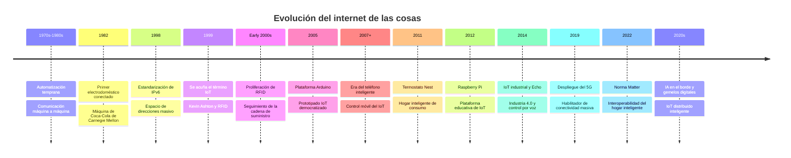

```mermaid
timeline
    title Evolución del internet de las cosas
    1970s-1980s : Automatización temprana
                : Comunicación máquina a máquina
    1982 : Primer electrodoméstico conectado
         : Máquina de Coca-Cola de Carnegie Mellon
    1998 : Estandarización de IPv6
         : Espacio de direcciones masivo
    1999 : Se acuña el término IoT
         : Kevin Ashton y RFID
    Early 2000s : Proliferación de RFID
                : Seguimiento de la cadena de suministro
    2005 : Plataforma Arduino
         : Prototipado IoT democratizado
    2007+ : Era del teléfono inteligente
          : Control móvil del IoT
    2011 : Termostato Nest
         : Hogar inteligente de consumo
    2012 : Raspberry Pi
         : Plataforma educativa de IoT
    2014 : IoT industrial y Echo
         : Industria 4.0 y control por voz
    2019 : Despliegue del 5G
         : Habilitador de conectividad masiva
    2022 : Norma Matter
         : Interoperabilidad del hogar inteligente
    2020s : IA en el borde y gemelos digitales
          : IoT distribuido inteligente
```
