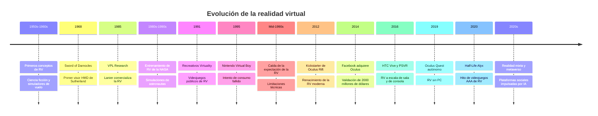

```mermaid
timeline
    title Evolución de la realidad virtual
    1950s-1960s : Primeros conceptos de RV
                : Ciencia ficción y simuladores de vuelo
    1968 : Sword of Damocles
         : Primer visor HMD de Sutherland
    1985 : VPL Research
         : Lanier comercializa la RV
    1980s-1990s : Entrenamiento de RV de la NASA
                : Simulaciones de astronautas
    1991 : Recreativos Virtuality
         : Videojuegos públicos de RV
    1995 : Nintendo Virtual Boy
         : Intento de consumo fallido
    Mid-1990s : Caída de la expectación de la RV
              : Limitaciones técnicas
    2012 : Kickstarter de Oculus Rift
         : Renacimiento de la RV moderna
    2014 : Facebook adquiere Oculus
         : Validación de 2000 millones de dólares
    2016 : HTC Vive y PSVR
         : RV a escala de sala y de consola
    2019 : Oculus Quest autónomo
         : RV sin PC
    2020 : Half-Life Alyx
         : Hito de videojuegos AAA de RV
    2020s : Realidad mixta y metaverso
          : Plataformas sociales impulsadas por IA
```
