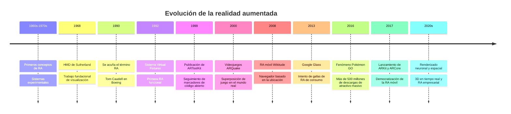

```mermaid
timeline
    title Evolución de la realidad aumentada
    1960s-1970s : Primeros conceptos de RA
                : Sistemas experimentales
    1968 : HMD de Sutherland
         : Trabajo fundacional de visualización
    1990 : Se acuña el término RA
         : Tom Caudell en Boeing
    1992 : Sistema Virtual Fixtures
         : Primera RA funcional
    1999 : Publicación de ARToolKit
         : Seguimiento de marcadores de código abierto
    2000 : Videojuegos ARQuake
         : Superposición de juego en el mundo real
    2008 : RA móvil Wikitude
         : Navegador basado en la ubicación
    2013 : Google Glass
         : Intento de gafas de RA de consumo
    2016 : Fenómeno Pokémon GO
         : Más de 500 millones de descargas de atractivo masivo
    2017 : Lanzamiento de ARKit y ARCore
         : Democratización de la RA móvil
    2020s : Renderizado neuronal y espacial
          : 3D en tiempo real y RA empresarial
```
