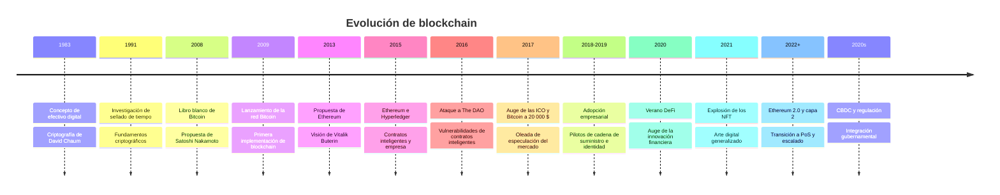

```mermaid
timeline
    title Evolución de blockchain
    1983 : Concepto de efectivo digital
         : Criptografía de David Chaum
    1991 : Investigación de sellado de tiempo
         : Fundamentos criptográficos
    2008 : Libro blanco de Bitcoin
         : Propuesta de Satoshi Nakamoto
    2009 : Lanzamiento de la red Bitcoin
         : Primera implementación de blockchain
    2013 : Propuesta de Ethereum
         : Visión de Vitalik Buterin
    2015 : Ethereum e Hyperledger
         : Contratos inteligentes y empresa
    2016 : Ataque a The DAO
         : Vulnerabilidades de contratos inteligentes
    2017 : Auge de las ICO y Bitcoin a 20 000 $
         : Oleada de especulación del mercado
    2018-2019 : Adopción empresarial
              : Pilotos de cadena de suministro e identidad
    2020 : Verano DeFi
         : Auge de la innovación financiera
    2021 : Explosión de los NFT
         : Arte digital generalizado
    2022+ : Ethereum 2.0 y capa 2
          : Transición a PoS y escalado
    2020s : CBDC y regulación
          : Integración gubernamental
```
