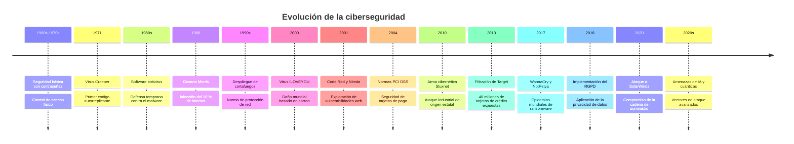

```mermaid
timeline
    title Evolución de la ciberseguridad
    1960s-1970s : Seguridad básica con contraseñas
                : Control de acceso físico
    1971 : Virus Creeper
         : Primer código autorreplicante
    1980s : Software antivirus
          : Defensa temprana contra el malware
    1988 : Gusano Morris
         : Infección del 10 % de internet
    1990s : Despliegue de cortafuegos
          : Norma de protección de red
    2000 : Virus ILOVEYOU
         : Daño mundial basado en correo
    2001 : Code Red y Nimda
         : Explotación de vulnerabilidades web
    2004 : Normas PCI DSS
         : Seguridad de tarjetas de pago
    2010 : Arma cibernética Stuxnet
         : Ataque industrial de origen estatal
    2013 : Filtración de Target
         : 40 millones de tarjetas de crédito expuestas
    2017 : WannaCry y NotPetya
         : Epidemias mundiales de ransomware
    2018 : Implementación del RGPD
         : Aplicación de la privacidad de datos
    2020 : Ataque a SolarWinds
         : Compromiso de la cadena de suministro
    2020s : Amenazas de IA y cuánticas
          : Vectores de ataque avanzados
```
