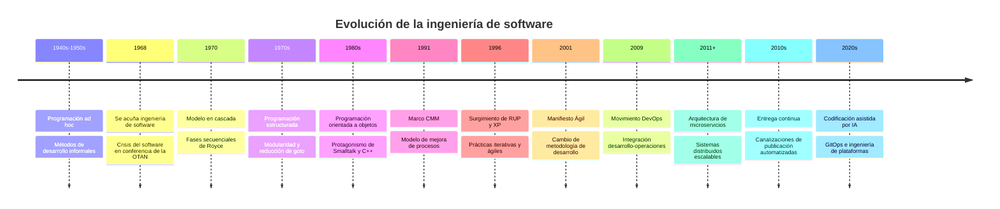

```mermaid
timeline
    title Evolución de la ingeniería de software
    1940s-1950s : Programación ad hoc
                : Métodos de desarrollo informales
    1968 : Se acuña ingeniería de software
         : Crisis del software en conferencia de la OTAN
    1970 : Modelo en cascada
         : Fases secuenciales de Royce
    1970s : Programación estructurada
          : Modularidad y reducción de goto
    1980s : Programación orientada a objetos
          : Protagonismo de Smalltalk y C++
    1991 : Marco CMM
         : Modelo de mejora de procesos
    1996 : Surgimiento de RUP y XP
         : Prácticas iterativas y ágiles
    2001 : Manifiesto Ágil
         : Cambio de metodología de desarrollo
    2009 : Movimiento DevOps
         : Integración desarrollo-operaciones
    2011+ : Arquitectura de microservicios
          : Sistemas distribuidos escalables
    2010s : Entrega continua
          : Canalizaciones de publicación automatizadas
    2020s : Codificación asistida por IA
          : GitOps e ingeniería de plataformas
```
