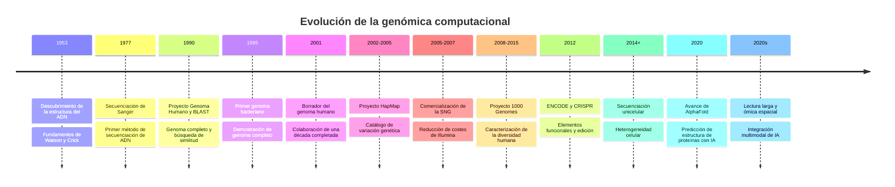

```mermaid
timeline
    title Evolución de la genómica computacional
    1953 : Descubrimiento de la estructura del ADN
         : Fundamentos de Watson y Crick
    1977 : Secuenciación de Sanger
         : Primer método de secuenciación de ADN
    1990 : Proyecto Genoma Humano y BLAST
         : Genoma completo y búsqueda de similitud
    1995 : Primer genoma bacteriano
         : Demostración de genoma completo
    2001 : Borrador del genoma humano
         : Colaboración de una década completada
    2002-2005 : Proyecto HapMap
              : Catálogo de variación genética
    2005-2007 : Comercialización de la SNG
              : Reducción de costes de Illumina
    2008-2015 : Proyecto 1000 Genomes
              : Caracterización de la diversidad humana
    2012 : ENCODE y CRISPR
         : Elementos funcionales y edición
    2014+ : Secuenciación unicelular
          : Heterogeneidad celular
    2020 : Avance de AlphaFold
         : Predicción de estructura de proteínas con IA
    2020s : Lectura larga y ómica espacial
          : Integración multimodal de IA
```
