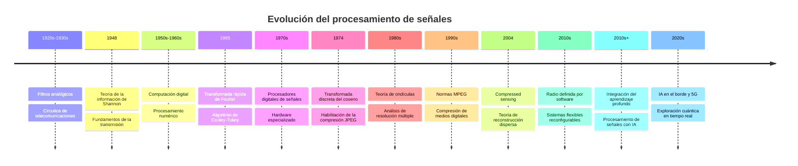

```mermaid
timeline
    title Evolución del procesamiento de señales
    1920s-1930s : Filtros analógicos
                : Circuitos de telecomunicaciones
    1948 : Teoría de la información de Shannon
         : Fundamentos de la transmisión
    1950s-1960s : Computación digital
                : Procesamiento numérico
    1965 : Transformada rápida de Fourier
         : Algoritmo de Cooley-Tukey
    1970s : Procesadores digitales de señales
          : Hardware especializado
    1974 : Transformada discreta del coseno
         : Habilitación de la compresión JPEG
    1980s : Teoría de ondículas
          : Análisis de resolución múltiple
    1990s : Normas MPEG
          : Compresión de medios digitales
    2004 : Compressed sensing
         : Teoría de reconstrucción dispersa
    2010s : Radio definida por software
          : Sistemas flexibles reconfigurables
    2010s+ : Integración del aprendizaje profundo
           : Procesamiento de señales con IA
    2020s : IA en el borde y 5G
          : Exploración cuántica en tiempo real
```
