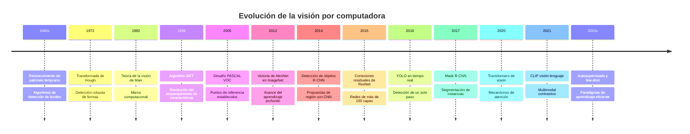

```mermaid
timeline
    title Evolución de la visión por computadora
    1960s : Reconocimiento de patrones temprano
          : Algoritmos de detección de bordes
    1972 : Transformada de Hough
         : Detección robusta de formas
    1982 : Teoría de la visión de Marr
         : Marco computacional
    1999 : Algoritmo SIFT
         : Revolución del emparejamiento de características
    2005 : Desafío PASCAL VOC
         : Puntos de referencia establecidos
    2012 : Victoria de AlexNet en ImageNet
         : Avance del aprendizaje profundo
    2014 : Detección de objetos R-CNN
         : Propuestas de región con CNN
    2015 : Conexiones residuales de ResNet
         : Redes de más de 100 capas
    2016 : YOLO en tiempo real
         : Detección de un solo paso
    2017 : Mask R-CNN
         : Segmentación de instancias
    2020 : Transformers de visión
         : Mecanismos de atención
    2021 : CLIP visión-lenguaje
         : Multimodal contrastivo
    2020s : Autosupervisado y few-shot
          : Paradigmas de aprendizaje eficiente
```
