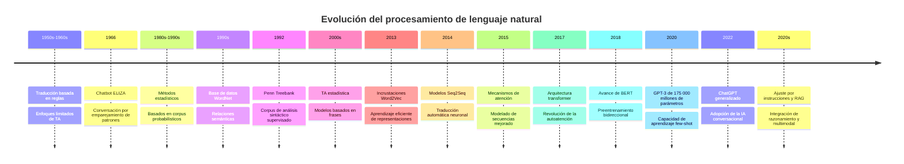

```mermaid
timeline
    title Evolución del procesamiento de lenguaje natural
    1950s-1960s : Traducción basada en reglas
                : Enfoques limitados de TA
    1966 : Chatbot ELIZA
         : Conversación por emparejamiento de patrones
    1980s-1990s : Métodos estadísticos
                : Basados en corpus probabilísticos
    1990s : Base de datos WordNet
          : Relaciones semánticas
    1992 : Penn Treebank
         : Corpus de análisis sintáctico supervisado
    2000s : TA estadística
          : Modelos basados en frases
    2013 : Incrustaciones Word2Vec
         : Aprendizaje eficiente de representaciones
    2014 : Modelos Seq2Seq
         : Traducción automática neuronal
    2015 : Mecanismos de atención
         : Modelado de secuencias mejorado
    2017 : Arquitectura transformer
         : Revolución de la autoatención
    2018 : Avance de BERT
         : Preentrenamiento bidireccional
    2020 : GPT-3 de 175 000 millones de parámetros
         : Capacidad de aprendizaje few-shot
    2022 : ChatGPT generalizado
         : Adopción de la IA conversacional
    2020s : Ajuste por instrucciones y RAG
          : Integración de razonamiento y multimodal
```
