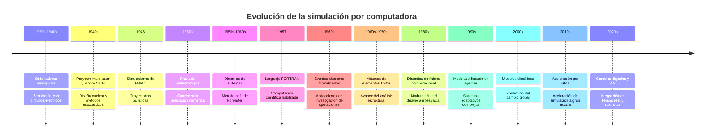

```mermaid
timeline
    title Evolución de la simulación por computadora
    1930s-1940s : Ordenadores analógicos
                : Simulación con circuitos eléctricos
    1940s : Proyecto Manhattan y Monte Carlo
          : Diseño nuclear y métodos estocásticos
    1946 : Simulaciones de ENIAC
         : Trayectorias balísticas
    1950s : Previsión meteorológica
          : Comienza la predicción numérica
    1950s-1960s : Dinámica de sistemas
                : Metodología de Forrester
    1957 : Lenguaje FORTRAN
         : Computación científica habilitada
    1960s : Eventos discretos formalizados
          : Aplicaciones de investigación de operaciones
    1960s-1970s : Métodos de elementos finitos
                : Avance del análisis estructural
    1980s : Dinámica de fluidos computacional
          : Maduración del diseño aeroespacial
    1990s : Modelado basado en agentes
          : Sistemas adaptativos complejos
    2000s : Modelos climáticos
          : Predicción del cambio global
    2010s : Aceleración por GPU
          : Aceleración de simulación a gran escala
    2020s : Gemelos digitales y AA
          : Integración en tiempo real y sustitutos
```
