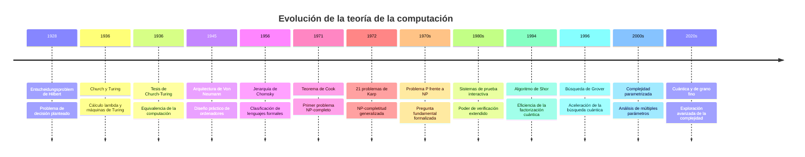

```mermaid
timeline
    title Evolución de la teoría de la computación
    1928 : Entscheidungsproblem de Hilbert
         : Problema de decisión planteado
    1936 : Church y Turing
         : Cálculo lambda y máquinas de Turing
    1936 : Tesis de Church-Turing
         : Equivalencia de la computación
    1945 : Arquitectura de Von Neumann
         : Diseño práctico de ordenadores
    1956 : Jerarquía de Chomsky
         : Clasificación de lenguajes formales
    1971 : Teorema de Cook
         : Primer problema NP-completo
    1972 : 21 problemas de Karp
         : NP-completitud generalizada
    1970s : Problema P frente a NP
          : Pregunta fundamental formalizada
    1980s : Sistemas de prueba interactiva
          : Poder de verificación extendido
    1994 : Algoritmo de Shor
         : Eficiencia de la factorización cuántica
    1996 : Búsqueda de Grover
         : Aceleración de la búsqueda cuántica
    2000s : Complejidad parametrizada
          : Análisis de múltiples parámetros
    2020s : Cuántica y de grano fino
          : Exploración avanzada de la complejidad
```
