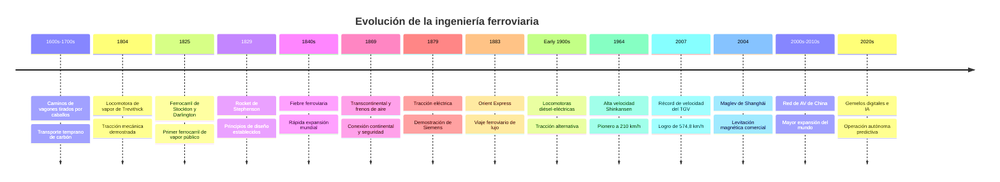

```mermaid
timeline
    title Evolución de la ingeniería ferroviaria
    1600s-1700s : Caminos de vagones tirados por caballos
                : Transporte temprano de carbón
    1804 : Locomotora de vapor de Trevithick
         : Tracción mecánica demostrada
    1825 : Ferrocarril de Stockton y Darlington
         : Primer ferrocarril de vapor público
    1829 : Rocket de Stephenson
         : Principios de diseño establecidos
    1840s : Fiebre ferroviaria
          : Rápida expansión mundial
    1869 : Transcontinental y frenos de aire
         : Conexión continental y seguridad
    1879 : Tracción eléctrica
         : Demostración de Siemens
    1883 : Orient Express
         : Viaje ferroviario de lujo
    Early 1900s : Locomotoras diésel-eléctricas
                : Tracción alternativa
    1964 : Alta velocidad Shinkansen
         : Pionero a 210 km/h
    2007 : Récord de velocidad del TGV
         : Logro de 574,8 km/h
    2004 : Maglev de Shanghái
         : Levitación magnética comercial
    2000s-2010s : Red de AV de China
                : Mayor expansión del mundo
    2020s : Gemelos digitales e IA
          : Operación autónoma predictiva
```
