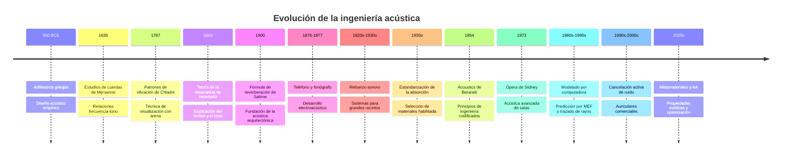

```mermaid
timeline
    title Evolución de la ingeniería acústica
    500 BCE : Anfiteatros griegos
            : Diseño acústico empírico
    1636 : Estudios de cuerdas de Mersenne
         : Relaciones frecuencia-tono
    1787 : Patrones de vibración de Chladni
         : Técnica de visualización con arena
    1863 : Teoría de la resonancia de Helmholtz
         : Explicación del timbre y el tono
    1900 : Fórmula de reverberación de Sabine
         : Fundación de la acústica arquitectónica
    1876-1877 : Teléfono y fonógrafo
              : Desarrollo electroacústico
    1920s-1930s : Refuerzo sonoro
                : Sistemas para grandes recintos
    1930s : Estandarización de la absorción
          : Selección de materiales habilitada
    1954 : Acoustics de Beranek
         : Principios de ingeniería codificados
    1973 : Ópera de Sídney
         : Acústica avanzada de salas
    1980s-1990s : Modelado por computadora
                : Predicción por MEF y trazado de rayos
    1990s-2000s : Cancelación activa de ruido
                : Auriculares comerciales
    2020s : Metamateriales y AA
          : Propiedades exóticas y optimización
```
