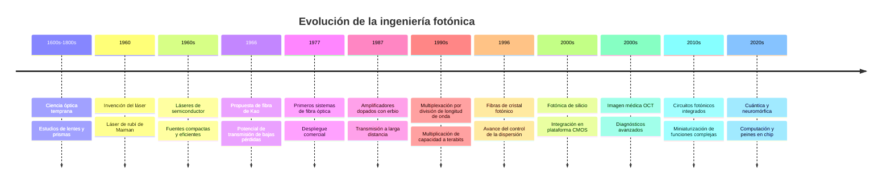

```mermaid
timeline
    title Evolución de la ingeniería fotónica
    1600s-1800s : Ciencia óptica temprana
                : Estudios de lentes y prismas
    1960 : Invención del láser
         : Láser de rubí de Maiman
    1960s : Láseres de semiconductor
          : Fuentes compactas y eficientes
    1966 : Propuesta de fibra de Kao
         : Potencial de transmisión de bajas pérdidas
    1977 : Primeros sistemas de fibra óptica
         : Despliegue comercial
    1987 : Amplificadores dopados con erbio
         : Transmisión a larga distancia
    1990s : Multiplexación por división de longitud de onda
          : Multiplicación de capacidad a terabits
    1996 : Fibras de cristal fotónico
         : Avance del control de la dispersión
    2000s : Fotónica de silicio
          : Integración en plataforma CMOS
    2000s : Imagen médica OCT
          : Diagnósticos avanzados
    2010s : Circuitos fotónicos integrados
          : Miniaturización de funciones complejas
    2020s : Cuántica y neuromórfica
          : Computación y peines en chip
```
