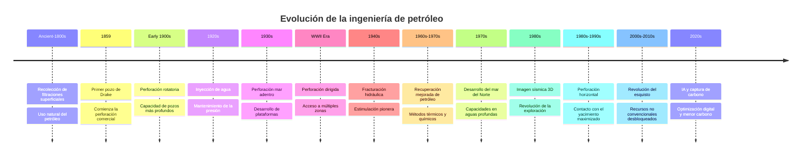

```mermaid
timeline
    title Evolución de la ingeniería de petróleo
    Ancient-1800s : Recolección de filtraciones superficiales
                  : Uso natural del petróleo
    1859 : Primer pozo de Drake
         : Comienza la perforación comercial
    Early 1900s : Perforación rotatoria
                : Capacidad de pozos más profundos
    1920s : Inyección de agua
          : Mantenimiento de la presión
    1930s : Perforación mar adentro
          : Desarrollo de plataformas
    WWII Era : Perforación dirigida
             : Acceso a múltiples zonas
    1940s : Fracturación hidráulica
          : Estimulación pionera
    1960s-1970s : Recuperación mejorada de petróleo
                : Métodos térmicos y químicos
    1970s : Desarrollo del mar del Norte
          : Capacidades en aguas profundas
    1980s : Imagen sísmica 3D
          : Revolución de la exploración
    1980s-1990s : Perforación horizontal
                : Contacto con el yacimiento maximizado
    2000s-2010s : Revolución del esquisto
                : Recursos no convencionales desbloqueados
    2020s : IA y captura de carbono
          : Optimización digital y menor carbono
```
