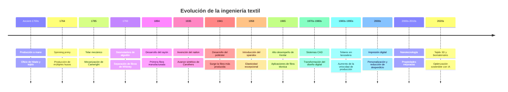

```mermaid
timeline
    title Evolución de la ingeniería textil
    Ancient-1700s : Producción a mano
                  : Oficio de hilado y tejido
    1764 : Spinning jenny
         : Producción de múltiples husos
    1785 : Telar mecánico
         : Mecanización de Cartwright
    1793 : Desmotadora de algodón
         : Separación de fibras de Whitney
    1894 : Desarrollo del rayón
         : Primera fibra manufacturada
    1935 : Invención del nailon
         : Avance sintético de Carothers
    1941 : Desarrollo del poliéster
         : Surge la fibra más producida
    1958 : Introducción del spandex
         : Elasticidad excepcional
    1965 : Alto desempeño de Kevlar
         : Aplicaciones de fibra técnica
    1970s-1980s : Sistemas CAD
                : Transformación del diseño digital
    1980s-1990s : Telares sin lanzadera
                : Aumento de la velocidad de producción
    2000s : Impresión digital
          : Personalización y reducción de desperdicio
    2000s-2010s : Nanotecnología
                : Propiedades mejoradas
    2020s : Tejido 3D y biomateriales
          : Optimización sostenible con IA
```
