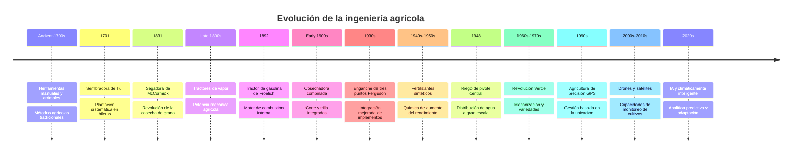

```mermaid
timeline
    title Evolución de la ingeniería agrícola
    Ancient-1700s : Herramientas manuales y animales
                  : Métodos agrícolas tradicionales
    1701 : Sembradora de Tull
         : Plantación sistemática en hileras
    1831 : Segadora de McCormick
         : Revolución de la cosecha de grano
    Late 1800s : Tractores de vapor
               : Potencia mecánica agrícola
    1892 : Tractor de gasolina de Froelich
         : Motor de combustión interna
    Early 1900s : Cosechadora combinada
                : Corte y trilla integrados
    1930s : Enganche de tres puntos Ferguson
          : Integración mejorada de implementos
    1940s-1950s : Fertilizantes sintéticos
                : Química de aumento del rendimiento
    1948 : Riego de pivote central
         : Distribución de agua a gran escala
    1960s-1970s : Revolución Verde
                : Mecanización y variedades
    1990s : Agricultura de precisión GPS
          : Gestión basada en la ubicación
    2000s-2010s : Drones y satélites
                : Capacidades de monitoreo de cultivos
    2020s : IA y climáticamente inteligente
          : Analítica predictiva y adaptación
```
