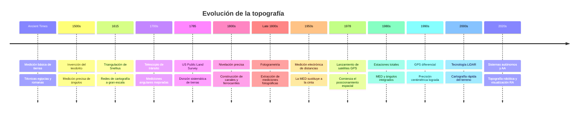

```mermaid
timeline
    title Evolución de la topografía
    Ancient Times : Medición básica de tierras
                  : Técnicas egipcias y romanas
    1500s : Invención del teodolito
          : Medición precisa de ángulos
    1615 : Triangulación de Snellius
         : Redes de cartografía a gran escala
    1700s : Telescopio de tránsito
          : Mediciones angulares mejoradas
    1785 : US Public Land Survey
         : División sistemática de tierras
    1800s : Nivelación precisa
          : Construcción de canales y ferrocarriles
    Late 1800s : Fotogrametría
               : Extracción de mediciones fotográficas
    1950s : Medición electrónica de distancias
          : La MED sustituye a la cinta
    1978 : Lanzamiento de satélites GPS
         : Comienza el posicionamiento espacial
    1980s : Estaciones totales
          : MED y ángulos integrados
    1990s : GPS diferencial
          : Precisión centimétrica lograda
    2000s : Tecnología LiDAR
          : Cartografía rápida del terreno
    2020s : Sistemas autónomos y AA
          : Topografía robótica y visualización RA
```
