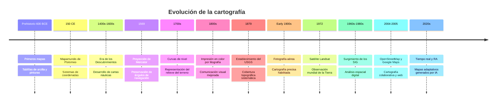

```mermaid
timeline
    title Evolución de la cartografía
    Prehistoric-600 BCE : Primeros mapas
                       : Tablillas de arcilla y pinturas
    150 CE : Mapamundis de Ptolomeo
           : Sistemas de coordenadas
    1400s-1600s : Era de los Descubrimientos
                : Desarrollo de cartas náuticas
    1569 : Proyección de Mercator
         : Preservación de ángulos de navegación
    1700s : Curvas de nivel
          : Representación del relieve del terreno
    1800s : Impresión en color por litografía
          : Comunicación visual mejorada
    1879 : Establecimiento del USGS
         : Cobertura topográfica sistemática
    Early 1900s : Fotografía aérea
                : Cartografía precisa habilitada
    1972 : Satélite Landsat
         : Observación mundial de la Tierra
    1960s-1980s : Surgimiento de los SIG
                : Análisis espacial digital
    2004-2005 : OpenStreetMap y Google Maps
              : Cartografía colaborativa y web
    2020s : Tiempo real y RA
          : Mapas adaptativos generados por IA
```
