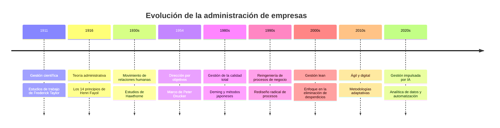

```mermaid
timeline
    title Evolución de la administración de empresas
    1911 : Gestión científica
         : Estudios de trabajo de Frederick Taylor
    1916 : Teoría administrativa
         : Los 14 principios de Henri Fayol
    1930s : Movimiento de relaciones humanas
          : Estudios de Hawthorne
    1954 : Dirección por objetivos
         : Marco de Peter Drucker
    1980s : Gestión de la calidad total
          : Deming y métodos japoneses
    1990s : Reingeniería de procesos de negocio
          : Rediseño radical de procesos
    2000s : Gestión lean
          : Enfoque en la eliminación de desperdicios
    2010s : Ágil y digital
          : Metodologías adaptativas
    2020s : Gestión impulsada por IA
          : Analítica de datos y automatización
```
