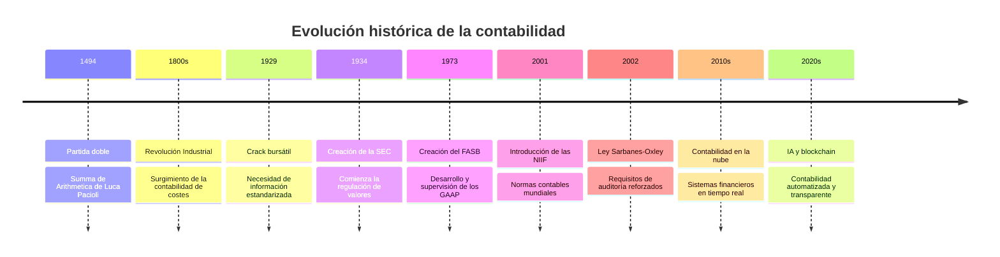

```mermaid
timeline
    title Evolución histórica de la contabilidad
    1494 : Partida doble
         : Summa de Arithmetica de Luca Pacioli
    1800s : Revolución Industrial
          : Surgimiento de la contabilidad de costes
    1929 : Crack bursátil
         : Necesidad de información estandarizada
    1934 : Creación de la SEC
         : Comienza la regulación de valores
    1973 : Creación del FASB
         : Desarrollo y supervisión de los GAAP
    2001 : Introducción de las NIIF
         : Normas contables mundiales
    2002 : Ley Sarbanes-Oxley
         : Requisitos de auditoría reforzados
    2010s : Contabilidad en la nube
          : Sistemas financieros en tiempo real
    2020s : IA y blockchain
          : Contabilidad automatizada y transparente
```
