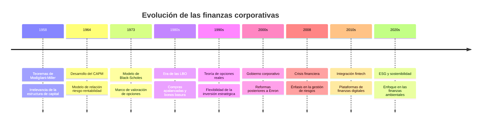

```mermaid
timeline
    title Evolución de las finanzas corporativas
    1958 : Teoremas de Modigliani-Miller
         : Irrelevancia de la estructura de capital
    1964 : Desarrollo del CAPM
         : Modelo de relación riesgo-rentabilidad
    1973 : Modelo de Black-Scholes
         : Marco de valoración de opciones
    1980s : Era de las LBO
          : Compras apalancadas y bonos basura
    1990s : Teoría de opciones reales
          : Flexibilidad de la inversión estratégica
    2000s : Gobierno corporativo
          : Reformas posteriores a Enron
    2008 : Crisis financiera
         : Énfasis en la gestión de riesgos
    2010s : Integración fintech
          : Plataformas de finanzas digitales
    2020s : ESG y sostenibilidad
          : Enfoque en las finanzas ambientales
```
