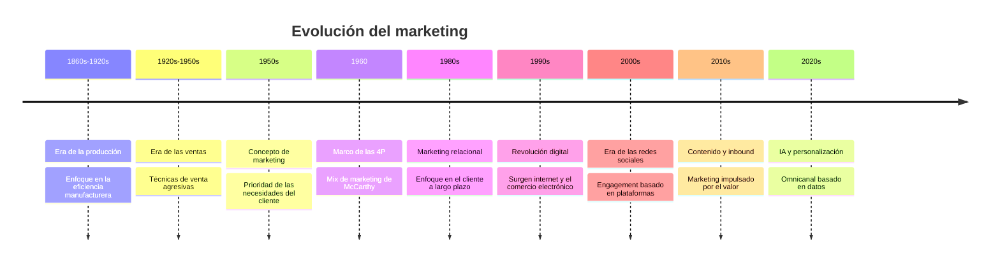

```mermaid
timeline
    title Evolución del marketing
    1860s-1920s : Era de la producción
                : Enfoque en la eficiencia manufacturera
    1920s-1950s : Era de las ventas
                : Técnicas de venta agresivas
    1950s : Concepto de marketing
          : Prioridad de las necesidades del cliente
    1960 : Marco de las 4P
         : Mix de marketing de McCarthy
    1980s : Marketing relacional
          : Enfoque en el cliente a largo plazo
    1990s : Revolución digital
          : Surgen internet y el comercio electrónico
    2000s : Era de las redes sociales
          : Engagement basado en plataformas
    2010s : Contenido y inbound
          : Marketing impulsado por el valor
    2020s : IA y personalización
          : Omnicanal basado en datos
```
