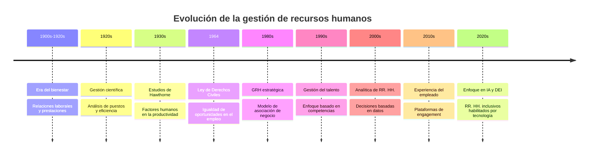

```mermaid
timeline
    title Evolución de la gestión de recursos humanos
    1900s-1920s : Era del bienestar
                : Relaciones laborales y prestaciones
    1920s : Gestión científica
          : Análisis de puestos y eficiencia
    1930s : Estudios de Hawthorne
          : Factores humanos en la productividad
    1964 : Ley de Derechos Civiles
         : Igualdad de oportunidades en el empleo
    1980s : GRH estratégica
          : Modelo de asociación de negocio
    1990s : Gestión del talento
          : Enfoque basado en competencias
    2000s : Analítica de RR. HH.
          : Decisiones basadas en datos
    2010s : Experiencia del empleado
          : Plataformas de engagement
    2020s : Enfoque en IA y DEI
          : RR. HH. inclusivos habilitados por tecnología
```
