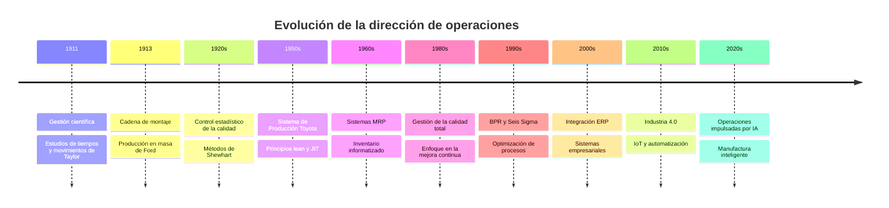

```mermaid
timeline
    title Evolución de la dirección de operaciones
    1911 : Gestión científica
         : Estudios de tiempos y movimientos de Taylor
    1913 : Cadena de montaje
         : Producción en masa de Ford
    1920s : Control estadístico de la calidad
          : Métodos de Shewhart
    1950s : Sistema de Producción Toyota
          : Principios lean y JIT
    1960s : Sistemas MRP
          : Inventario informatizado
    1980s : Gestión de la calidad total
          : Enfoque en la mejora continua
    1990s : BPR y Seis Sigma
          : Optimización de procesos
    2000s : Integración ERP
          : Sistemas empresariales
    2010s : Industria 4.0
          : IoT y automatización
    2020s : Operaciones impulsadas por IA
          : Manufactura inteligente
```
