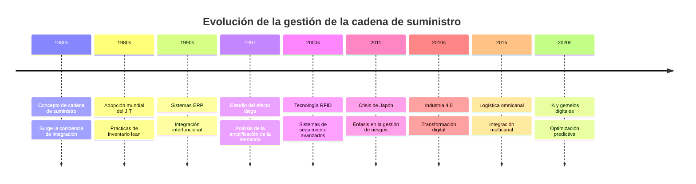

```mermaid
timeline
    title Evolución de la gestión de la cadena de suministro
    1980s : Concepto de cadena de suministro
          : Surge la conciencia de integración
    1980s : Adopción mundial del JIT
          : Prácticas de inventario lean
    1990s : Sistemas ERP
          : Integración interfuncional
    1997 : Estudio del efecto látigo
         : Análisis de la amplificación de la demanda
    2000s : Tecnología RFID
          : Sistemas de seguimiento avanzados
    2011 : Crisis de Japón
         : Énfasis en la gestión de riesgos
    2010s : Industria 4.0
          : Transformación digital
    2015 : Logística omnicanal
         : Integración multicanal
    2020s : IA y gemelos digitales
          : Optimización predictiva
```
